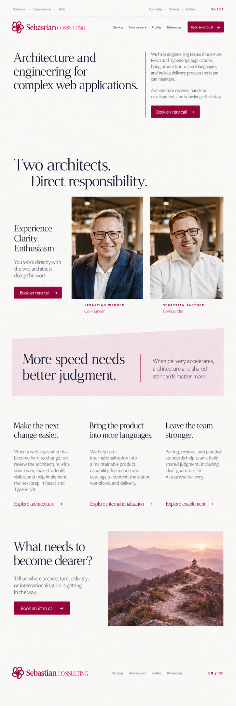
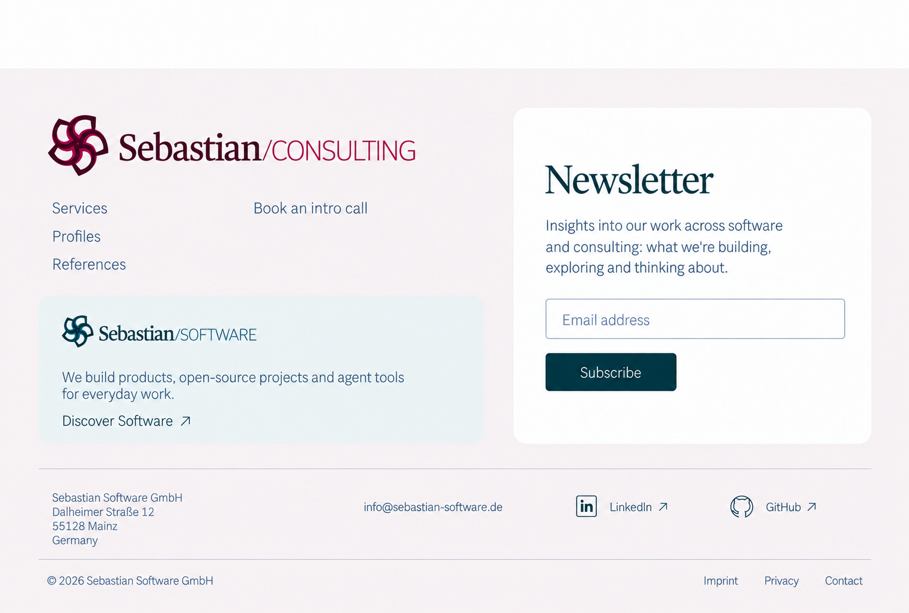

# Consulting homepage design

The selected concept leads with architecture and engineering for complex web applications, gives both founders equal portrait frames, uses one contained pink judgment passage, and closes with a visible trail toward an overlook. This directory prepares design assets for the planned Consulting application.

These are visual concepts. The reusable source images are collected in [app/assets](../app/assets/README.md). [Asset metadata](asset-manifest.json) records their dimensions, origin, and checksums; [exact reconstruction prompts](asset-prompts.json) record the built-in ImageGen requests.

## Selected Consulting homepage, revision 9

## Shared frame and current footer

The [current frame gallery](../../../packages/ui/design/refinements-r3/README.md) shows the floating 48px header target, separate current-site navigation, and contextual footers. It supersedes the frame areas in the earlier homepage reference.

The current site owns the main logo and local footer navigation. The other brand has a smaller explanatory entry; the newsletter spans both.

