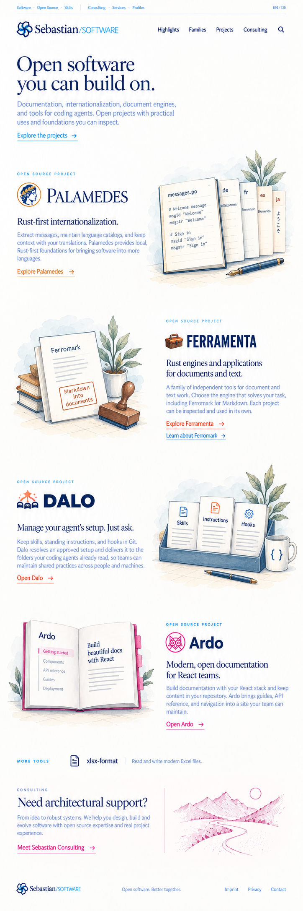
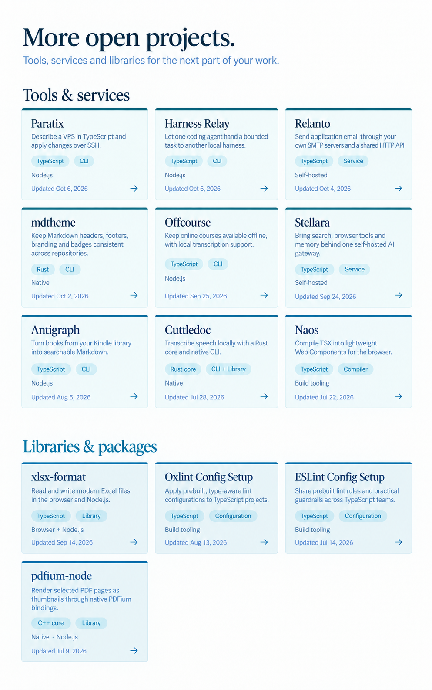

# Open Source homepage design

The four illustrated stories cover Palamedes, Ferramenta, Dalo, and Ardo. The complete inline tile section follows them on the same homepage and replaces the old small-project row visible in the earlier full-page concept. All thirteen additional eligible projects are shown inline. Ferramenta remains one family; Effective remains deferred. This directory prepares design assets for the planned Open Source application.

These are visual concepts. The reusable source images are collected in [app/assets](../app/assets/README.md). [Asset metadata](asset-manifest.json) records their dimensions, origin, and checksums; [exact reconstruction prompts](asset-prompts.json) record the built-in ImageGen requests.

## Featured project stories, revision 6

## Complete inline project section, revision 9

## Shared frame and current page ending

Use the [implementation brief](../../../design/IMPLEMENTATION-BRIEF.md) for the
current requirements, complete tile collection, metrics ordering, and completion criteria.

Implementation is tracked in [#18](https://github.com/sebastian-software/sebastian-websites/issues/18),
with the shared frame in [#16](https://github.com/sebastian-software/sebastian-websites/issues/16).

The [editorial collection seed](collection-seed.json) records the initial thirteen
additional projects, their public sources, classifications, family exclusions,
and captured activity. It is a starting dataset, not a runtime count limit.

The [current frame gallery](../../../packages/ui/design/refinements-r5/README.md) gives the current website the only logo and presents the other website as an editorial outward invitation. It supersedes the frame areas in the earlier homepage reference.

This site uses the Software context: shared newsletter, illustrated Consulting invitation, then the inset Software footer.

