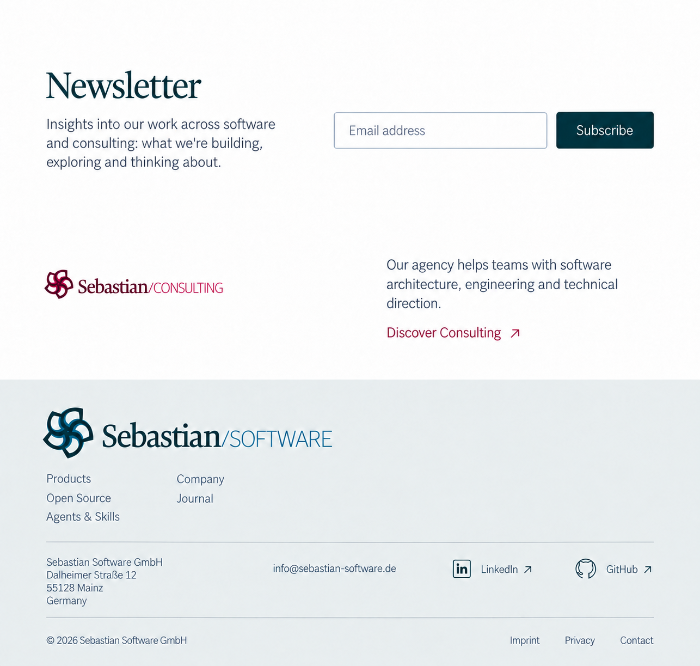

# Skills site frame

The planned Skills application uses the Software brand and the [current shared frame](../../../packages/ui/design/refinements-r4/README.md). “Agents & Skills” is the proposed navigation label for this existing site.

The compact floating header has a 48 CSS-pixel implementation target. Software navigation and language stay together; the full Consulting lockup occupies a neutral white sibling zone in the same enclosing shell.

The page ending has three separate areas: shared newsletter, standalone Consulting offer, then the actual Software footer. White space separates the areas; the footer contains only current-site navigation and company/contact, monochrome social, and legal links.

The current round covers desktop. Earlier mobile studies remain in the shared frame archive.
