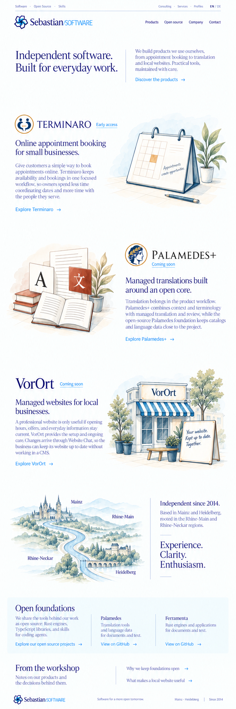
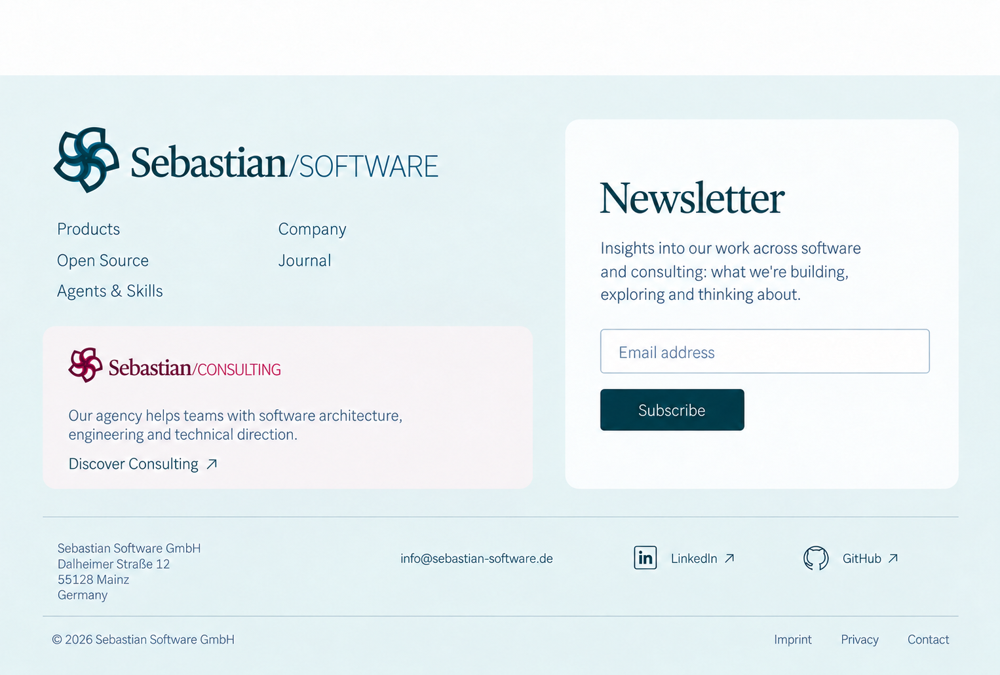

# Software homepage design

The product atlas presents Terminaro, Palamedes+, and VorOrt through alternating illustrated articles. The regional motif connects Mainz and Heidelberg. The calendar sentence, pavement-board sentence, and regional labels are blank so localized website text can be added later.

These are visual concepts. The reusable source images are collected in [app/assets](../app/assets/README.md). [Asset metadata](asset-manifest.json) records their dimensions, origin, and checksums; [exact reconstruction prompts](asset-prompts.json) record the built-in ImageGen requests.

## Selected commercial product atlas, revision 6

## Shared frame and current footer

The [current frame gallery](../../../packages/ui/design/refinements-r3/README.md) shows the floating 48px header target, separate current-site navigation, and contextual footers. It supersedes the frame areas in the earlier homepage reference.

The current site owns the main logo and local footer navigation. The other brand has a smaller explanatory entry; the newsletter spans both.

