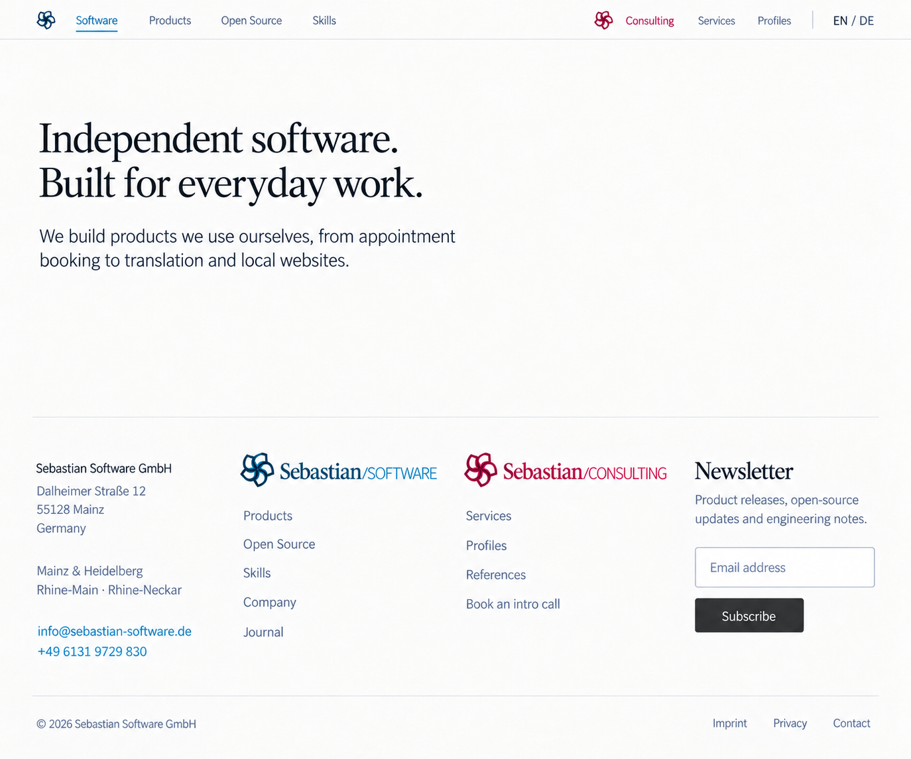
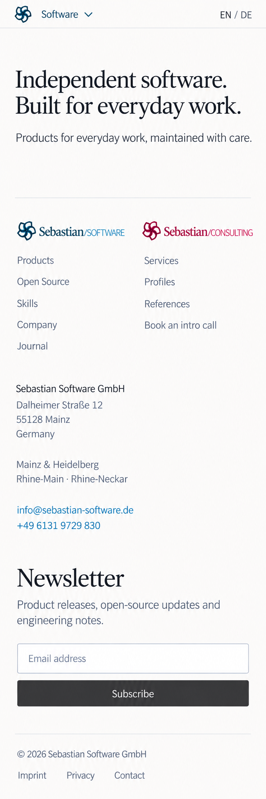
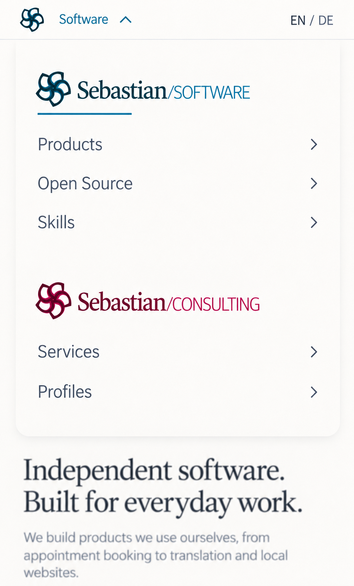

# Shared site frame

One common header and footer for Software, Open Source, Skills, and Consulting. The frame uses neutral lightly textured paper and graphite type; the original teal and berry brand marks retain equal prominence. The page content belongs to each app.

## Header

The design target is one compact 48 CSS-pixel row on desktop and mobile. Desktop links are grouped by brand: Software, Products, Open Source, Skills; Consulting, Services, Profiles; then EN / DE. A short active-site underline changes without moving the links or changing the frame layout.

On mobile, a current-site trigger opens the grouped website switcher. Both original brand wordmarks link to their homepages, with the area links below them. Cross-site links retain the selected language.

## Footer

The desktop footer has four generously spaced columns: company/contact, Software, Consulting, and Newsletter. On mobile the two brand link groups stay adjacent, followed by the full-width company/contact and newsletter sections.

The company address and phone come from the shared legal package. Mainz and Heidelberg remain named as the two locations; no separate Heidelberg street address is proposed. The bottom row contains copyright, Imprint, Privacy, and Contact.

Newsletter signup is a visual proposal. The service integration and the Software journal route can be configured when implemented. The existing brand SVGs remain the source artwork for implementation; logo renderings in these raster concepts are visual references.

## Desktop

The Software excerpt provides context for the common frame.

## Mobile

## Open mobile website switcher

## Sources

- [Navigation groups, company/contact data, proposed destinations, and layout targets](site-frame-links.json)
- [Exact built-in ImageGen prompts and portable image inputs](site-frame-prompts.json)
- [Image dimensions, selected versions, and checksums](site-frame-manifest.json)

These are visual design studies generated with built-in ImageGen. The two earlier desktop variants in references preserve the editing inputs; the three images above are the selected concepts.
