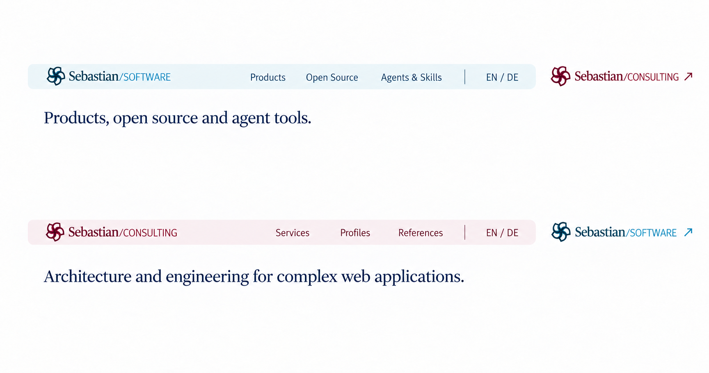
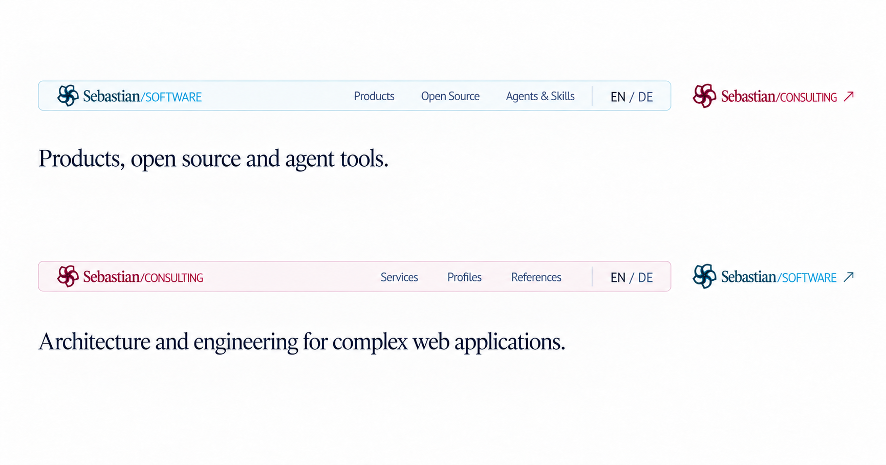
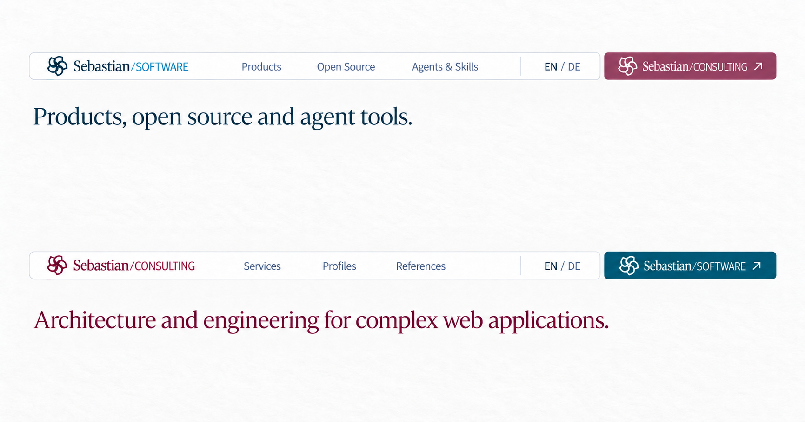
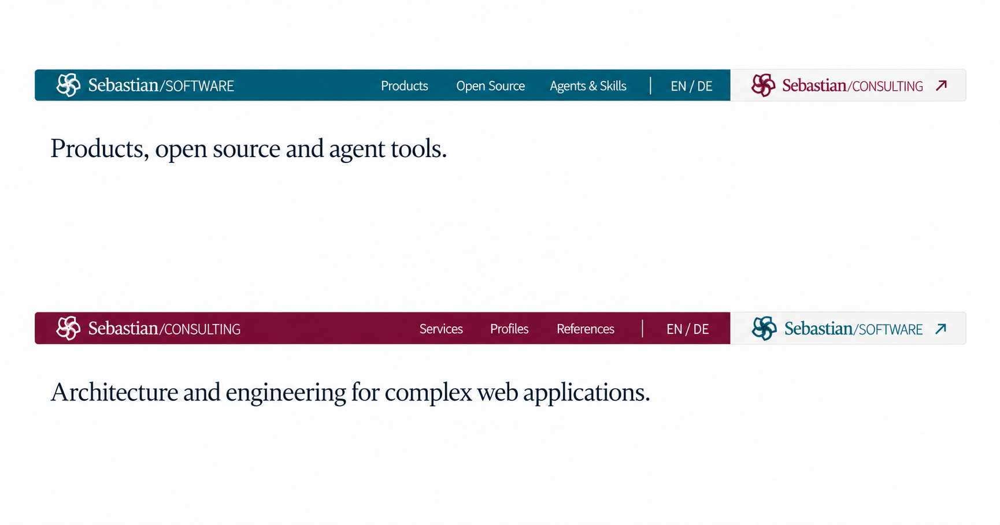
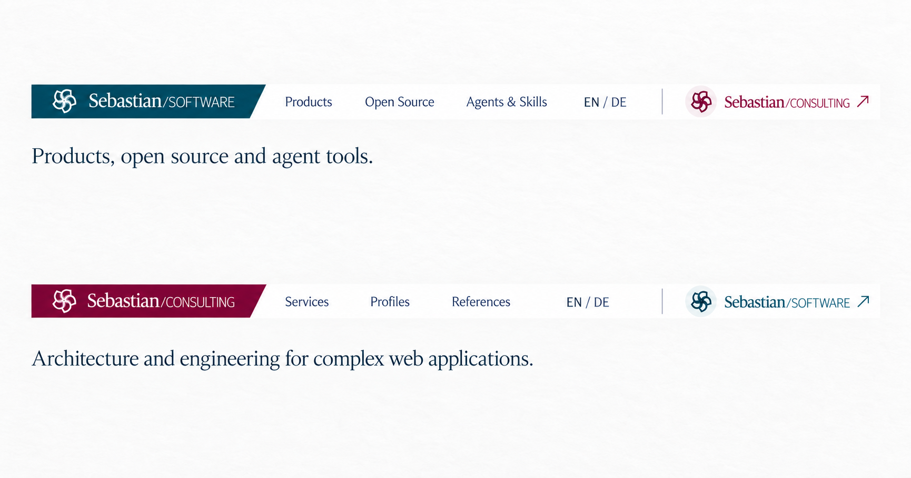
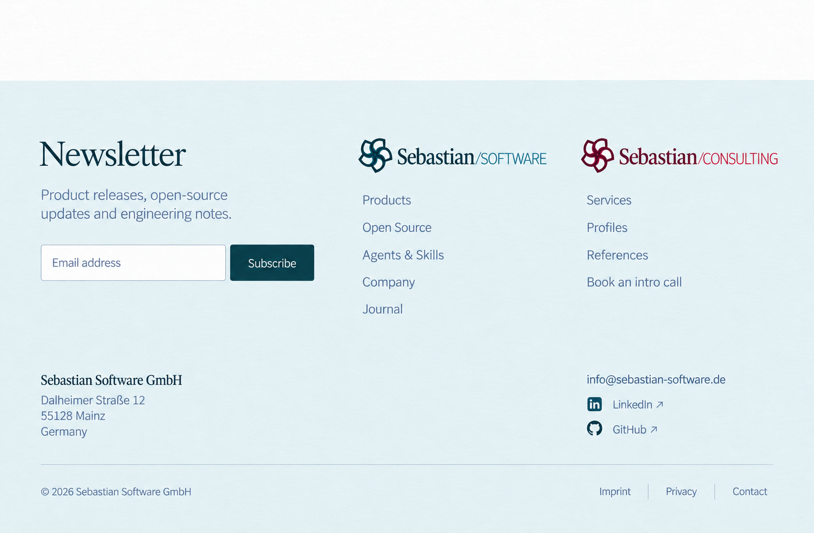
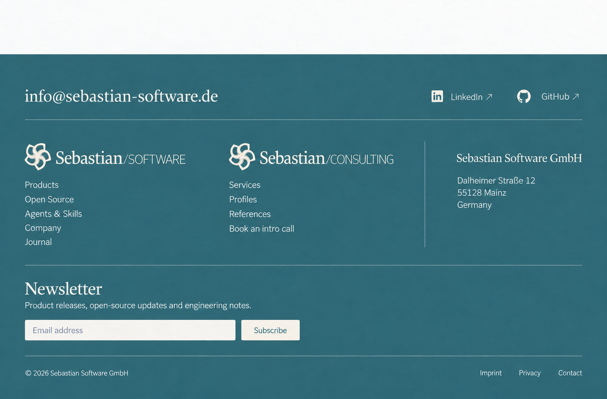
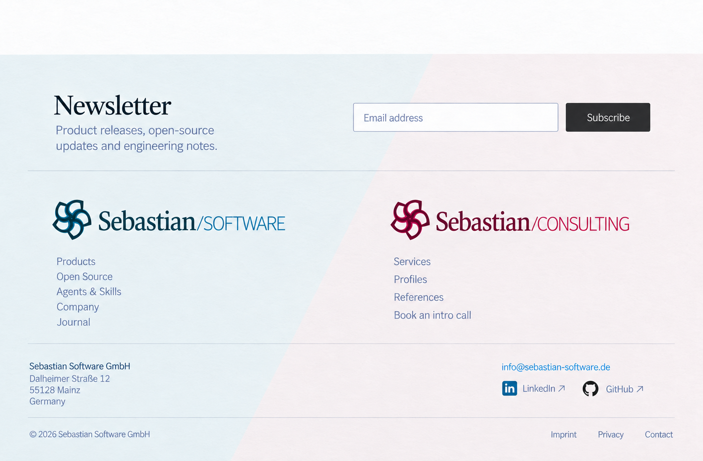
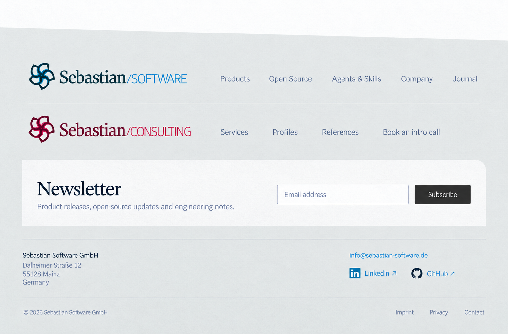
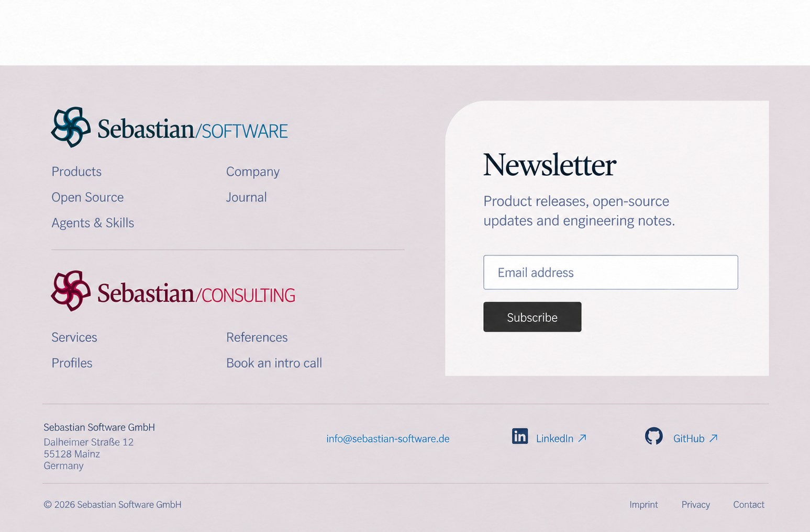

# Shared frame alternatives — round 2

Five desktop header ideas and five footer ideas. Headers and footers can be combined independently. This is the current visual direction; the [first round](../alternatives/README.md) remains available for comparison.

Every header image shows Software above and Consulting below using the same layout. The current site owns its logo, local navigation, and EN / DE control. The other brand has a separate website entry. Both entries retain the complete original Sebastian/Software or Sebastian/Consulting wordmark, including the slash.

The header implementation target is 48 CSS pixels. These raster studies show the compact proportions and inset floating treatment; the exact height remains a layout constraint for implementation. Open Source and the existing Skills site belong to the Software navigation context. “Agents & Skills” is a proposed label for that existing site.

Footers use the registered company address, email, [company LinkedIn](https://www.linkedin.com/company/sebastian-software/), and [company GitHub](https://github.com/sebastian-software). This round omits phone numbers, regional descriptions, and geographical artwork. Full-width footer color remains an option.

New serif text uses regular weight. Original logo letterforms remain unchanged. The original SVG lockups are the source artwork for implementation; generated raster logo renderings are visual references.

## Headers

### H01 — Tinted local zone

A soft current-brand tint holds the local navigation and language control. The full sibling wordmark sits separately on white.

### H02 — Inset navigation and separate margin link

A thin rounded outline encloses the current-site strip. The full sibling wordmark sits in the outer margin.

### H03 — Separated color tab

A white local strip is paired with a separate colored tab containing the full sibling wordmark.

### H04 — Current brand color band

The current brand owns the inset teal or berry strip; the full sibling wordmark occupies a neutral end zone.

### H05 — Brand flag and quiet bridge

A colored current-brand flag has one shallow diagonal end. Navigation stays on white, with a quiet separated sibling entry.

## Footers

### F01 — Frost endpaper

A pale teal endpaper puts the newsletter first, with two equally prominent brand indexes and a separate contact band.

### F02 — Muted teal social colophon

A muted teal surface begins with email and social links. Two reversed full brand wordmarks sit alongside the registered address.

### F03 — Two-tone publication spread

A pale two-tone spread uses one diagonal seam. The newsletter and legal bands unite the two brand sections.

### F04 — Sloped paper colophon

A gently sloped gray endpaper arranges the two brands as broad horizontal rows, followed by a white newsletter strip.

### F05 — Linen newsletter leaf

A restrained berry-gray surface stacks the two brand indexes beside a white newsletter leaf with one curved corner.

## Sources and provenance

- [Navigation contexts, full logo sources, company links, and layout targets](navigation-and-links.json)
- [Exact prompts and portable image inputs](prompts.json)
- [Native PNG dimensions and SHA-256 checksums](manifest.json)

Generated with built-in ImageGen. All ten final concepts are native PNGs copied without resizing or retouching. Header editing inputs are archived in `references/`; only the ten images above are final concepts.

The original design references include [Stripe](https://stripe.com), [Set.Studio](https://set.studio), and [Thinkmill](https://www.thinkmill.com.au). Their navigation hierarchy, inset framing, and footer surfaces informed these studies.

Newsletter signup and the Software journal remain visual proposals. Service integration and the journal route are still to be selected during implementation.
