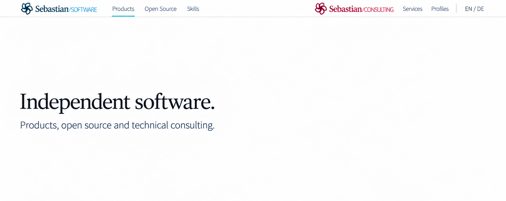
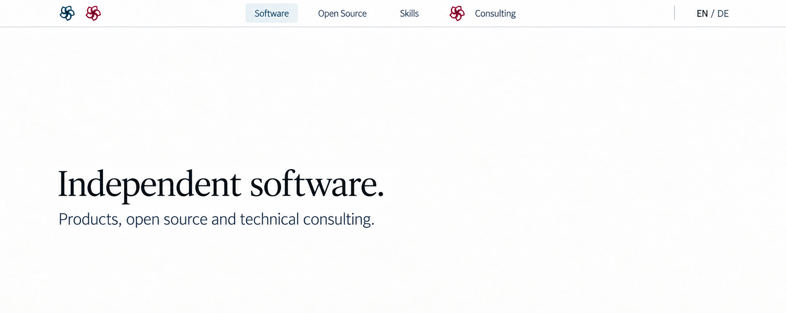
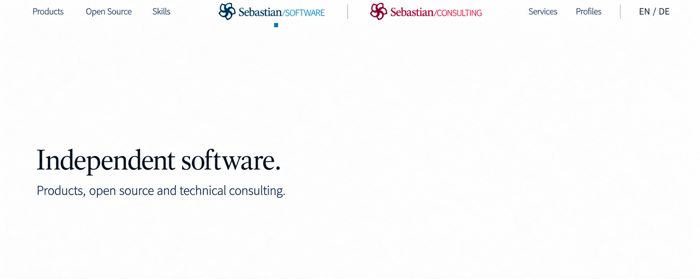
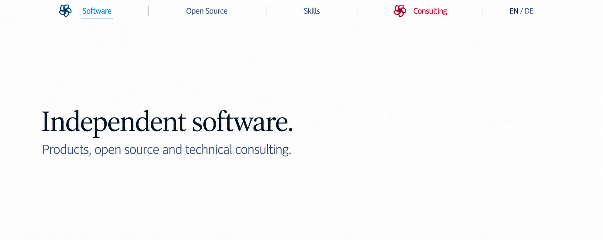
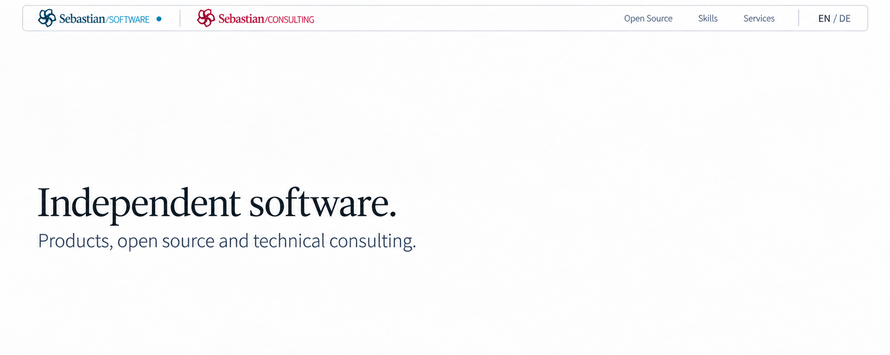
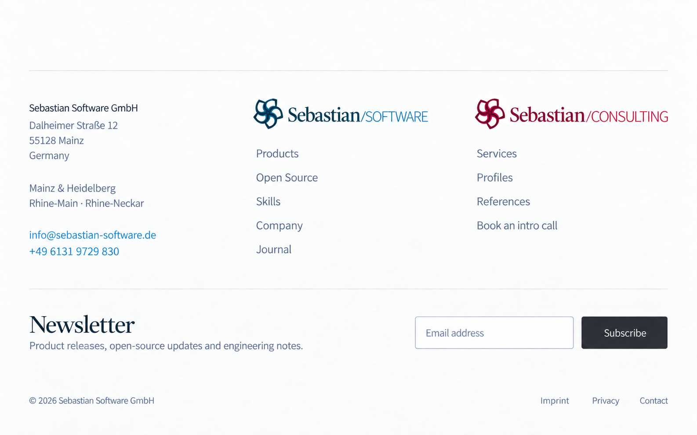
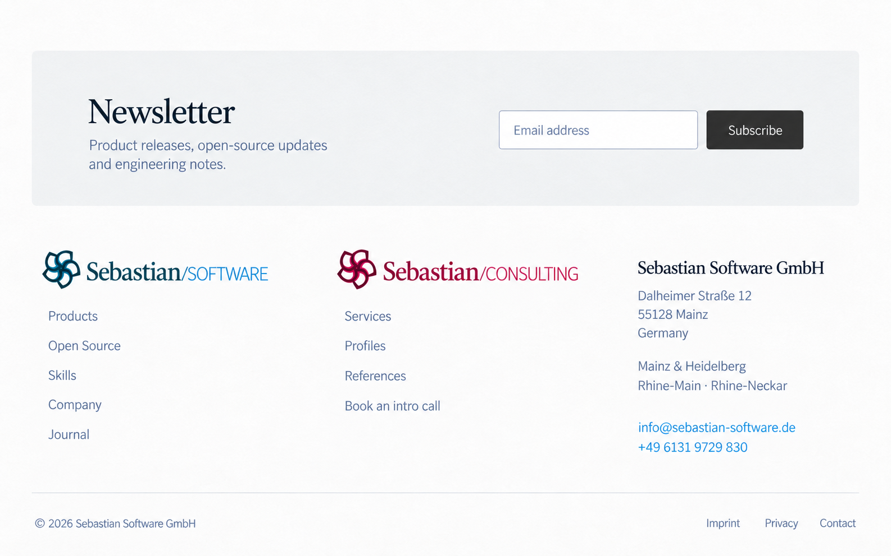
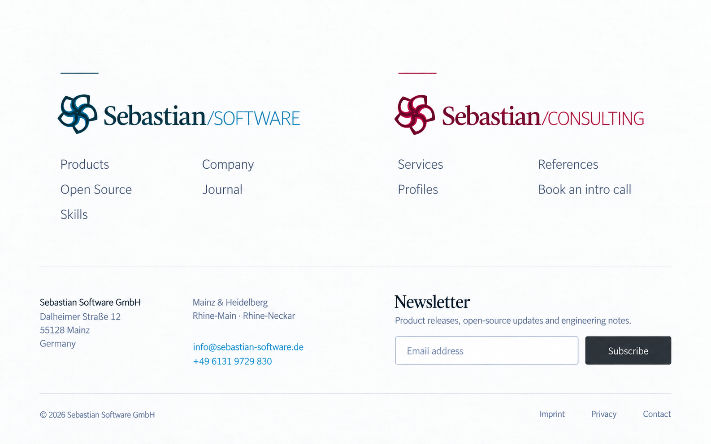
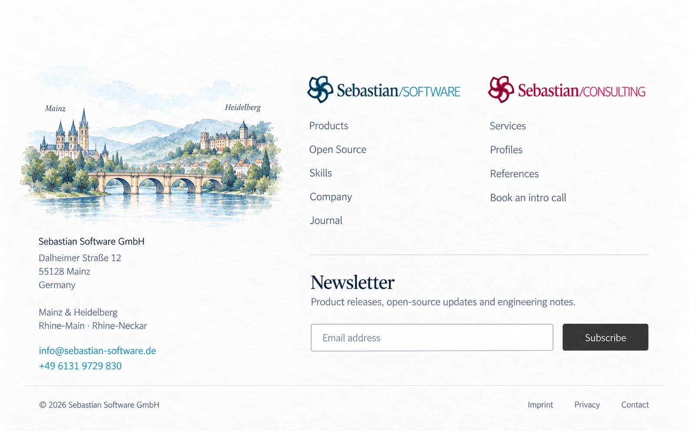
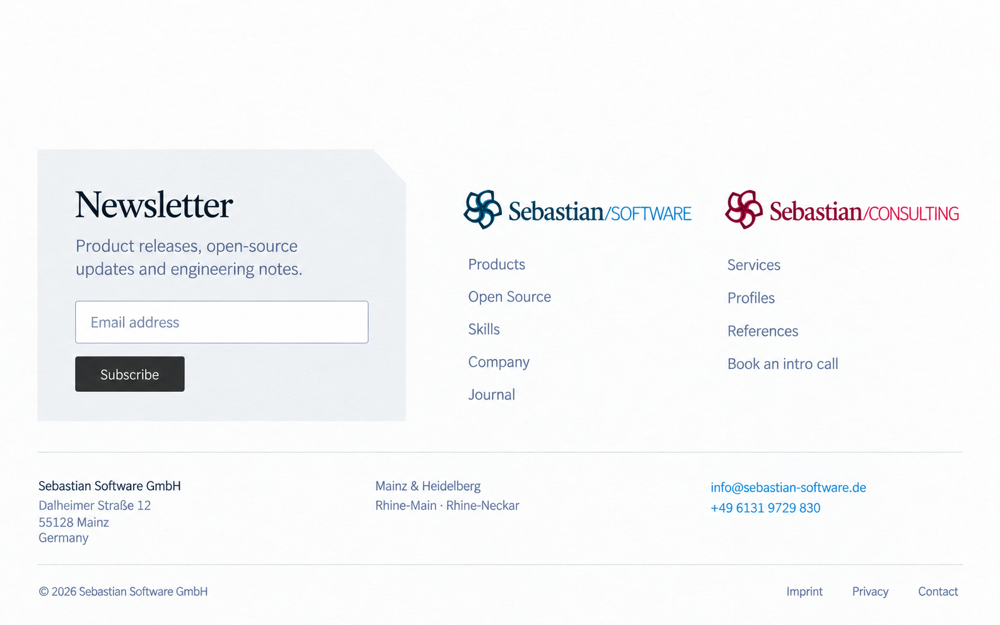

# Desktop header and footer alternatives

Five independent header layouts and five independent footer layouts, generated with built-in ImageGen. Any header can be paired with any footer. The same chosen layout can serve Software, Open Source, Skills, and Consulting; only the current-site marker changes. These are visual concepts, not implemented UI.

Headers target a compact 48 CSS-pixel row. Raster images communicate layout and proportion; the implementation will use that height explicitly. The small Software page excerpt provides scale and is not a new homepage proposal. Footers include equal Software and Consulting brand presence, company/contact details, both locations, a newsletter proposal, and legal links. The original brand SVGs remain the source artwork for implementation.

## Headers

### H01 — Brand bookends

The two complete wordmarks sit at opposite ends, each beside its own area links. A flexible central gap separates the two brands.

### H02 — Central site rail

Paired brand emblems anchor the left edge. A centered rail treats the four websites as one navigable family, with a subtle filled active tab.

### H03 — Centered twin wordmarks

The two original wordmarks form a central pair. Software links sit to the left and Consulting links to the right.

### H04 — Publication index

Four evenly spaced site names form a typographic index. Small original emblems identify Software and Consulting, and an underline marks the current site.

### H05 — Inset rounded bar

One contained navigation strip combines the paired wordmarks with the area links. A restrained rounded outline gives the header a softer edge.

## Footers

### F01 — Editorial colophon

Company/contact and the two brand indexes form three open columns. The newsletter occupies a separate horizontal row below them.

### F02 — Newsletter first

A contained newsletter strip starts the footer. Equal brand columns and a company/contact column follow with generous vertical separation.

### F03 — Two brand doorways

Two broad, equal brand sections use small internal link grids. Company/contact and newsletter form the quieter lower row.

### F04 — Regional colophon

A restrained illustration connects Mainz and Heidelberg beside the contact details. Brand navigation and newsletter occupy the remaining space.

### F05 — Asymmetric inset sheet

A contained newsletter sheet occupies the left side, with one gently clipped corner. Equal brand indexes sit to its right and company/contact details span the lower row.

## Sources

- [Exact prompts and portable image input paths](prompts.json)
- [Dimensions and source checksums](manifest.json)
- [Shared navigation destinations and company/contact data](../site-frame-links.json)

Initial header images are retained in `references/` as inputs to the compact-header refinements. The ten images in this gallery are the comparison set. Newsletter integration and the Software journal destination remain visual proposals.
