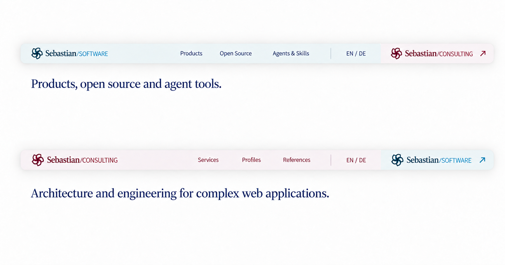

# Floating header and contextual footers — round 3

The selected header is enclosed in one floating shell with continuous iOS-style corners, a restrained shadow, and very pale brand-specific color zones. The sibling website entry now sits inside the shell while remaining separate from current-site navigation and language. Every logo retains its full original emblem and Sebastian/Software or Sebastian/Consulting wordmark, including the slash.

The common desktop header target remains 48 CSS pixels. Raster studies communicate the visual proportions; implementation must enforce the exact height. Mobile is outside this round's scope.

Each website now has its own primary footer branding and local navigation. A smaller sibling entry explains the other offering in one sentence and provides one action. The newsletter is shared across Software and Consulting, describing insights into the work and topics on the team's mind. It does not promise a sending frequency.

The final footer PNGs are stored in their corresponding app design directories. Open Source and the existing Skills site use the Software context. “Agents & Skills” remains a proposed navigation label for the existing Skills site.

## Header: both current-brand states

## Software footer

Software owns the main logo and navigation; the smaller Consulting entry explains the agency's architecture and engineering work.

## Consulting footer

Consulting owns the main logo and navigation; the smaller Software entry introduces products, open-source projects, and agent tools. The newsletter and footer layout stay consistent.

## Sources and provenance

- [Current navigation, footer contexts, copy, links, and layout targets](navigation-and-links.json)
- [Exact prompts and portable image inputs](prompts.json)
- [Native PNG dimensions and SHA-256 checksums](manifest.json)
- [Previous five-header/five-footer round](../alternatives-r2/README.md)

Generated with built-in ImageGen. The three final images are copied without resizing, cropping, or retouching. Editing inputs are preserved in `references/`. Original brand SVGs remain the source artwork for implementation.

Social symbols show a small single-color outline direction, using the same ink as surrounding text. Final SVG icons and their library remain to be selected; these concepts do not depend on any specific icon package.

The shared legal company address, email, and company LinkedIn/GitHub links remain in both footers. Phone numbers, regional descriptions, and geographical illustrations are omitted. Newsletter integration and the journal route remain visual proposals.
