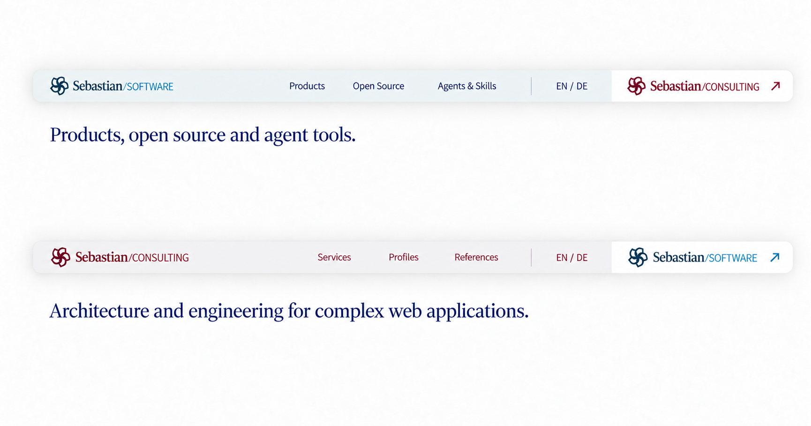
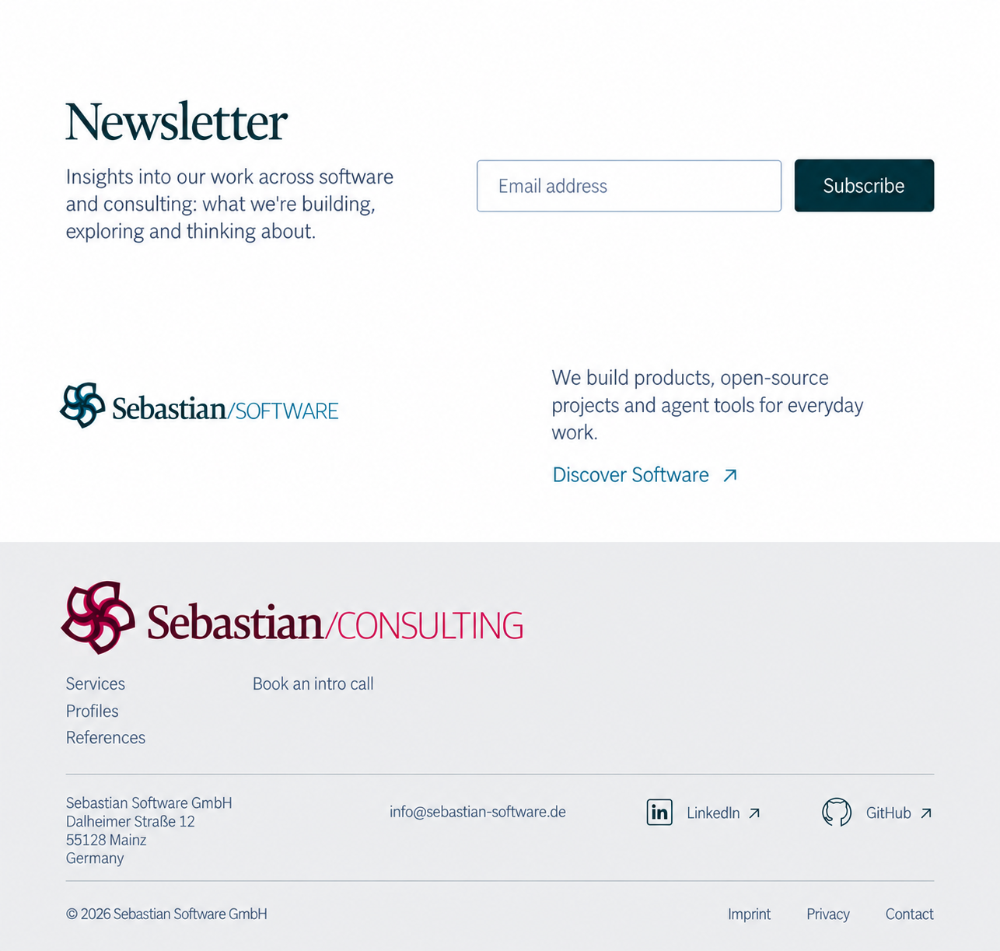

# Separated newsletter, sibling offer, and footer — round 4

The page ending is now three separate areas. Software uses **shared newsletter → Consulting offer → Software footer**. Consulting uses **shared newsletter → Software offer → Consulting footer**. The newsletter and sibling offer are outside the actual footer.

The first two areas use white backgrounds and generous vertical space. The current-site footer has a neutral gray surface. Original logo colors and small action accents provide brand identity; pink and pale-blue panels do not touch or form a two-tone composition.

The header retains its compact floating shell, continuous iOS-style corners, and soft shadow. The sibling zone is now white, while the current-site zone is neutral. Complete original wordmarks, local navigation, and the current site's language control remain. The implementation height target is 48 CSS pixels; mobile is outside this round's scope.

## Header in both brand states

## Software page ending

The shared newsletter comes first. A smaller Consulting wordmark, explanatory sentence, and action occupy their own white section. The actual Software footer follows, with only Software navigation and company/legal information.

## Consulting page ending

The shared newsletter is unchanged. The middle section introduces Software. The actual Consulting footer has its own primary wordmark and local navigation.

## Sources and provenance

- [Section sequence, current navigation, links, and layout targets](navigation-and-links.json)
- [Exact prompts and portable image inputs](prompts.json)
- [Native PNG dimensions and SHA-256 checksums](manifest.json)
- [Previous enclosed-footer studies](../refinements-r3/README.md)

Generated with built-in ImageGen. The three final PNGs are copied without resizing, cropping, or retouching. The Software and Consulting page endings live in their corresponding app design directories. Open Source and the existing Skills site use the Software context.

Original SVG logos remain the source artwork for implementation; every lockup retains Sebastian/ and the slash. New serif text uses regular weight. Social glyphs remain small and single-color; final SVG icons are still to be selected. Newsletter integration and the journal route remain visual proposals.
