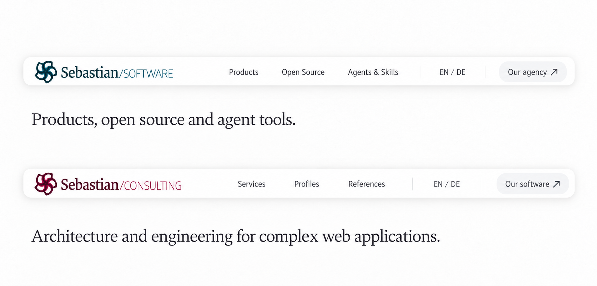
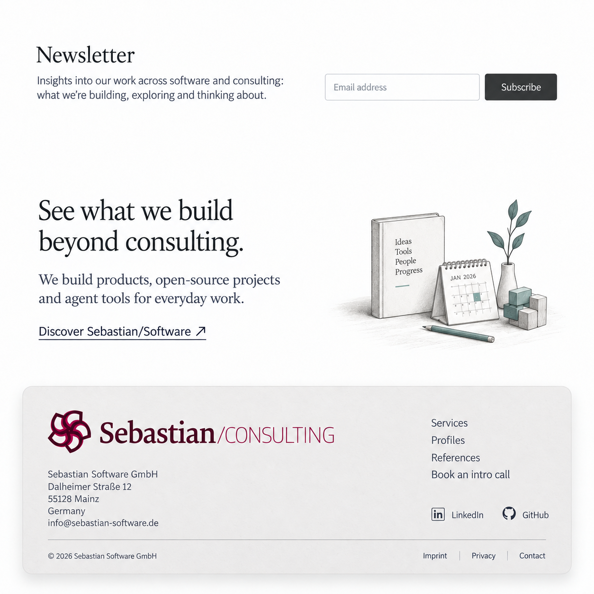

# Current publisher and outward invitation — round 5

The current website owns the visual identity. The other website is an outward editorial destination, with a different composition and role. It no longer appears as a second logo beside or above the current brand.

## Header in both brand states

Each floating header has one complete original current-site logo, local navigation, and the current site's language control. A small neutral utility capsule at the far end says **Our agency ↗** in the Software context or **Our software ↗** in the Consulting context. It uses ordinary text, without a sibling emblem or branded wordmark treatment.

Continuous corners and a diffuse shadow keep the inset bar light. The implementation target remains 48 CSS pixels; the raster illustrates hierarchy rather than exact CSS dimensions. Mobile is outside this study.

## Software page ending

The shared newsletter comes first. An unboxed editorial invitation explains the Consulting offer, with a small trail illustration and one plain-text outward action. The substantial inset Software footer then closes the page with its own original logo and local index.

## Consulting page ending

The same sequence introduces Software through a short editorial story and an illustrated book/calendar still life. The only logo belongs to the current Consulting footer.

## Sources and provenance

- [Hierarchy, section order, current navigation, copy, and links](navigation-and-links.json)
- [Exact generation and refinement prompts, with portable inputs](prompts.json)
- [Native PNG dimensions and SHA-256 checksums](manifest.json)
- [Previous separated-section studies](../refinements-r4/README.md)

Generated with built-in ImageGen. Three final PNGs and three refinement inputs are copied without resizing, cropping, or retouching. Page endings live in their corresponding app design directories; Open Source and Skills use the Software context.

Original SVG logos remain the artwork for implementation, with complete Sebastian/ wordmarks. The other website's name appears as ordinary text in the outward action. Serif text uses regular weight. The footer contains only current-site navigation, registered company details, company social links and legal links. Newsletter integration, the journal route and final single-color social SVG glyphs remain implementation choices.
